## Video

## Project Summary

Just like our subtitle indicating, the goal of our project is to ensure that the agent, Wallace, is able to find the best and fastest way out of the prison. As we know, prisoner usually failed to escape for many times before they finally succeed. Our project implements the reinforcement learning strategy, which make the agent do the same thing as in reality. 

In order to reach the final goal, Wallace will keep trying to escape until he finds the best choice to get out. Even though, he is likely to fail so many times before he can actually make it, he will learn something during the process of trying and failing with a multi-layer Q-learning algorithm that we create for him.

Moreover, we have updated a lot since the status report. Last time, our goal is merely focusing on the overall performance of the system. For instance, whether the rewards of those states are feasible or not, and whether it is possible to find out the ideal solution that we expected. However, right now we are focusing on whether it can be better, and whether it can handle various kinds of crucial situation that we had made to test it. In a machine learning expert’s perspective, the AI need to have low rate of error in both training and testing tasks. I will explain it in more details in the following few sections of the report.

## Approach

### Some Basic Information of Our project (in case you did not read anything before)

This is the map of our Minecraft world, which is also the prison where the agent, Wallace, was locked.

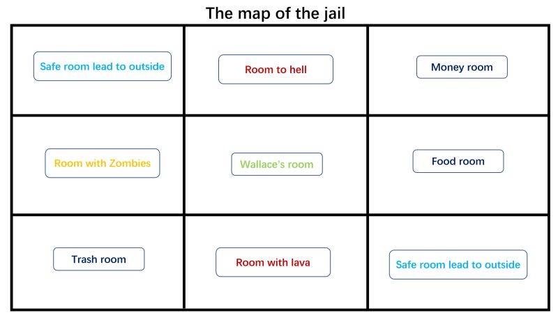

And in the game, it looks like this:

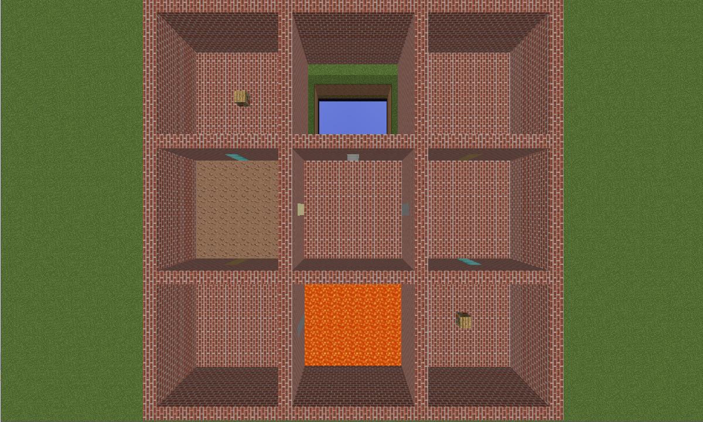

The main idea of this design is to explore the various kinds of choices that are presented to the agent. In this way, the agent does not know all the states at the beginning since different room contains different states, therefore it comes with two levels. The first one is the choices of selecting room, and the second level is the item in the room. Along with that, we have added in some random factor that might confuse the agent, which we will talk about it more in the following sections.

- ### States
  Originally, Our map has 9 rooms which are distributed in a 3 * 3 matrix.
  First row from left to right: Safe room, Hell, Money room.
  Second row from left to right: Zombies room, Wallace room, Foods room.
  Third row from left to right: Trash room, Lava room, Safe room.
  Different rooms hold different states.
  
  - Wallace room: Wallace room locates at the center of the map. Agent Wallace starts his journey from this room. In this room, we put TNT, ladder and redstones on the floor. Wallace should pick up all tools in this room.
  
  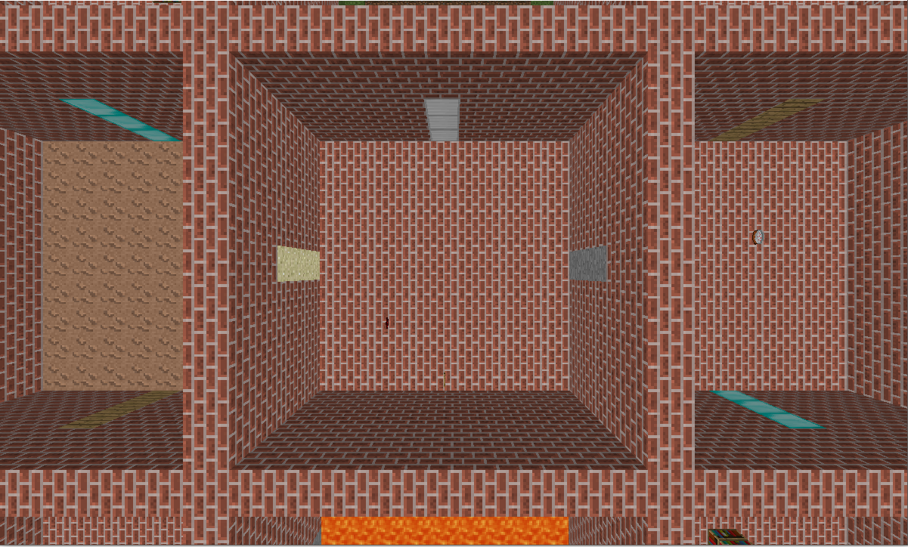
  
  - Foods room: There should be a cake in this room. Agent Wallace need to eat this cake to fill up its stamina.
  
  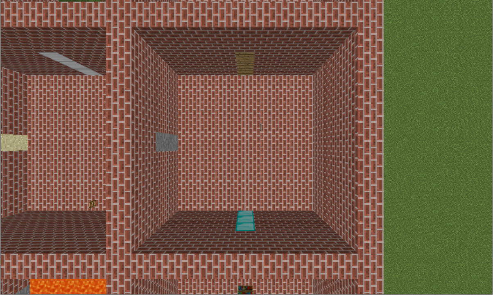
  
  - Money room: There is a gold in Money room. Agent Wallace can pick up and take the gold to escape map.
  
  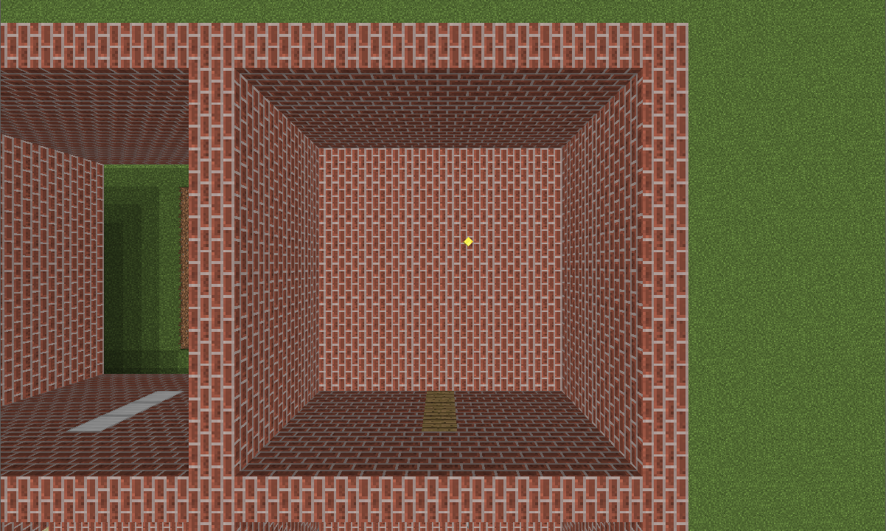
  
  - Safe room * 2: This rooms are safe zone and next to the exit. Agent Wallace can escape the prison from this room.
  
  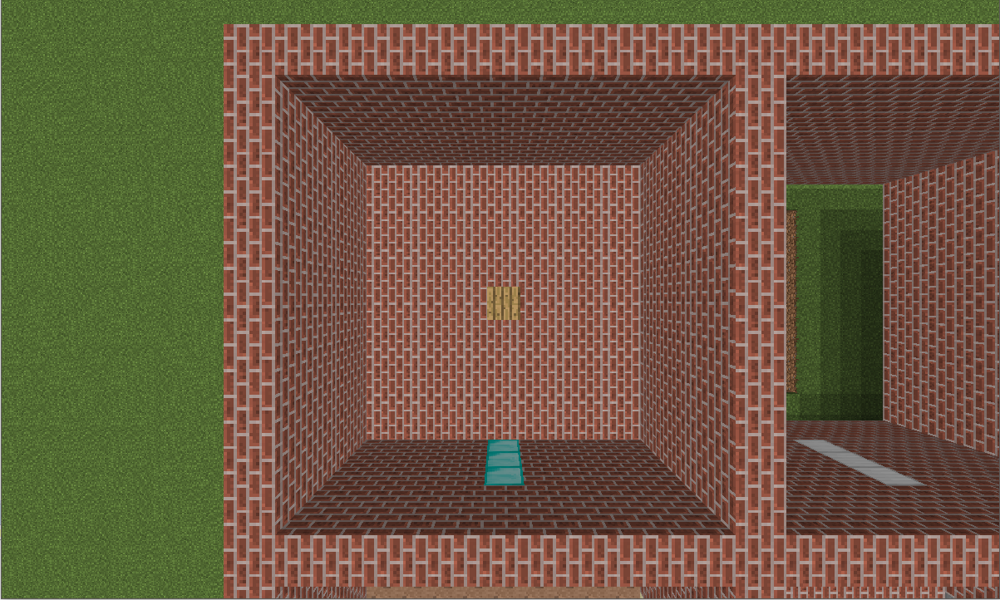
  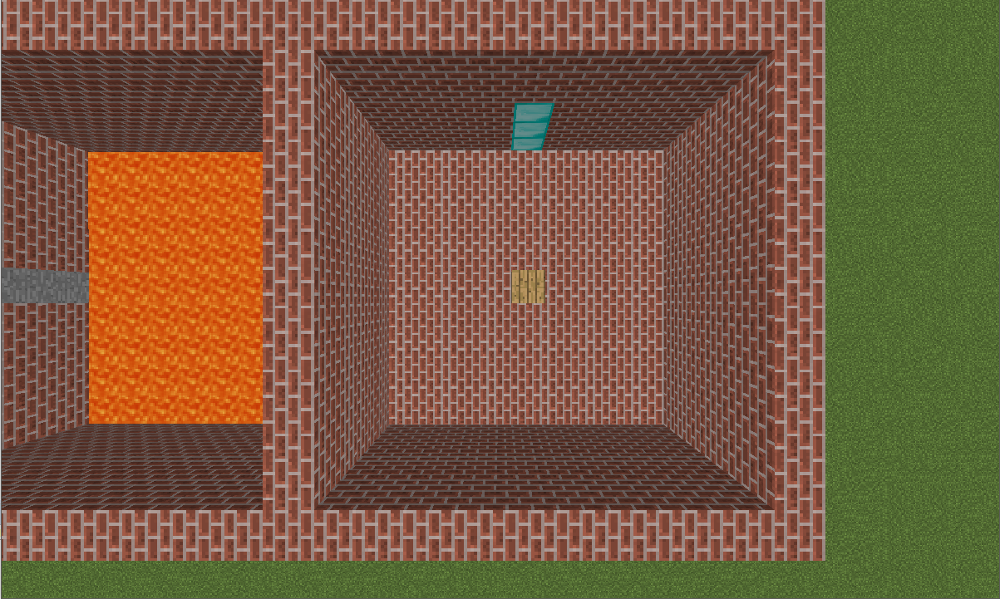
  
  - lava room: Agent Wallace should use the ladder that picked up in the Wallace room go over the lava safely. Otherwise, lava will kill the agent Wallace. 
  
  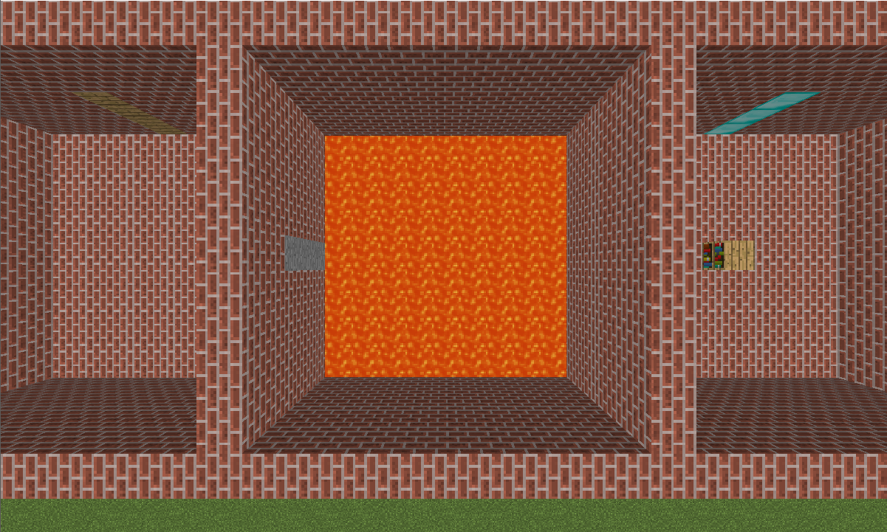
  
  - Hell: Agent Wallace should use the ladder that picked up in the Wallace room go over the hell safely. Otherwise, Wallace will fell into the hell.
  
  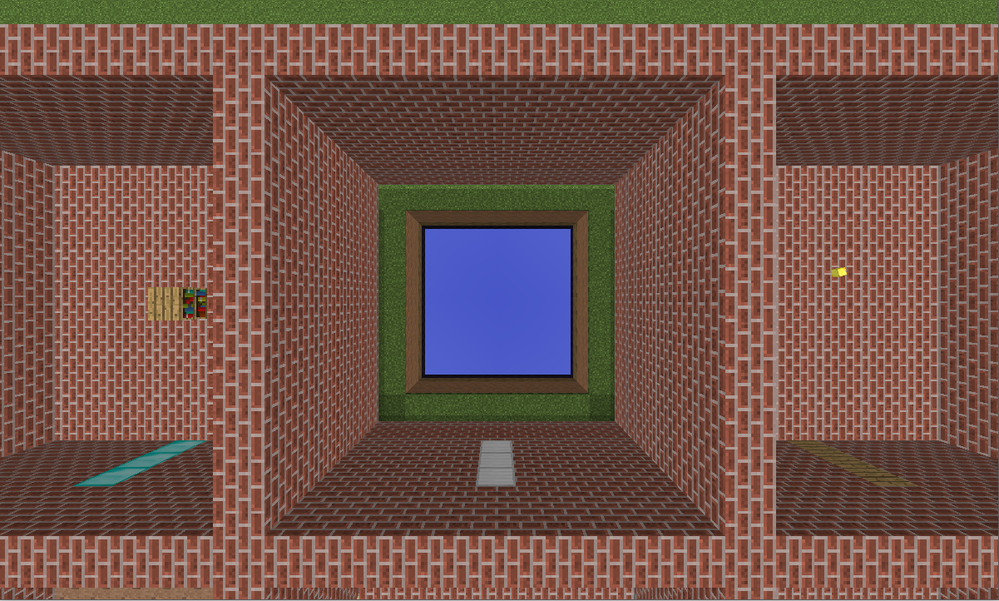
  
  - Zombies room: Agent Wallace should use TNT to kill zombies in this room.
  
  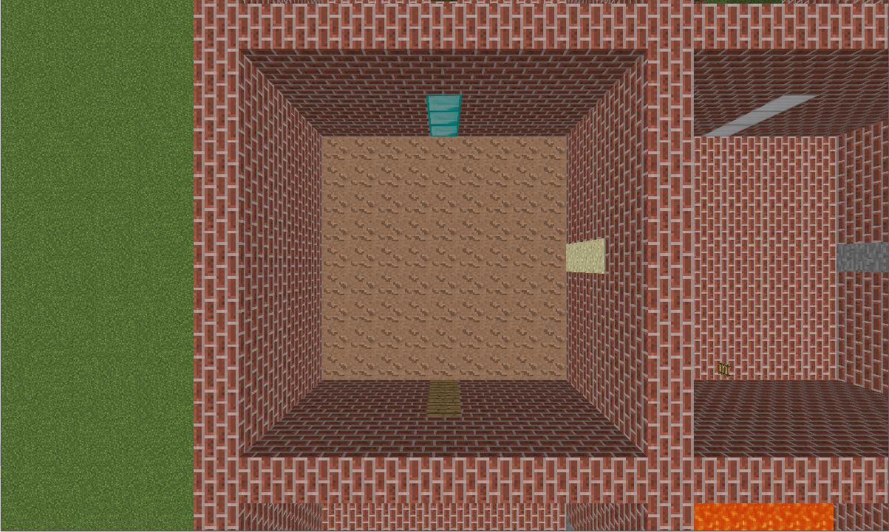
  
  - Trash room: This room is a trap. We set up trash room to allure agent Wallace. All the stuffs in this room is useless. Once agent Wallace picks it up in this room, Wallace will lose points.
  
  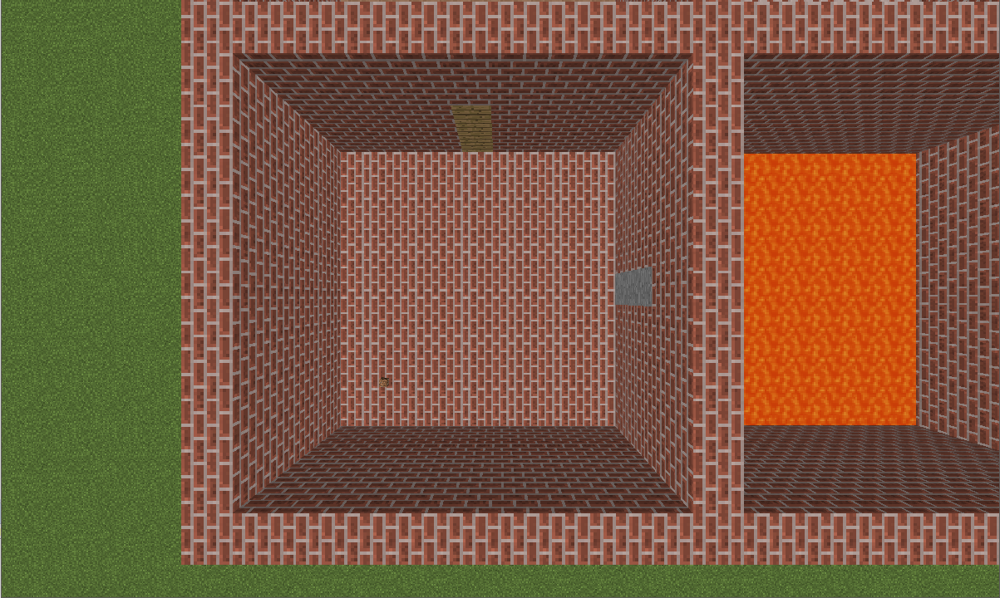
  
  - Nevertheless, we have add one more room into the world, which is the mysterious room. Every time the agent perforces teleport command, there is a possibility that it might be caught by the police, which they will send him to the mysterious room. By doing this, it really challenges the steps and luck of the agent. Moreover, it creates a lot of troubles for our original q-learning algorithm, but we had successfully found a solution to overcome it, and we will talk about it below.
  
  - Last but not least, we also modify the state a bit in an effort to increase the difficulties. Base on the real fact that carry too much money or food will slow down the speed and lower the possibilities to escape, we add more gold, cake, and some not useful stuffs into the rooms. Just to clarify, we set the reward of picking up a piece of gold + 100. However, we have added that if there is more than one gold on the body, than it will bring the agent a negative reward -50.
  
- ### Game Rules
  Main purpose: Our agent Wallace picks up different tools and enter different rooms to escape the prison.
  Rewards (there are just part of the reward map, since some of the reward rules are too confusing to talk about in the report):
  - Redstone: Pick up -- +50, Use and open the door -- -10 ~ -20;
  - TNT: Pick up -- -60, pick up more: -30, Kill zombie -- +80; kill by zombies -- -1000
  - Ladder: Pick up -- -1000
  - Cake: Pick up -- +50
  - Trash: Pick up -- -100;
  - Gold: Pick up -- +100.
  
### Algorithm

- First of all, our algorithm is written based on the Q-learning algorithm

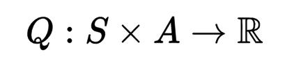
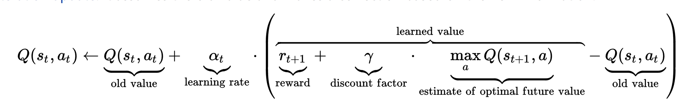
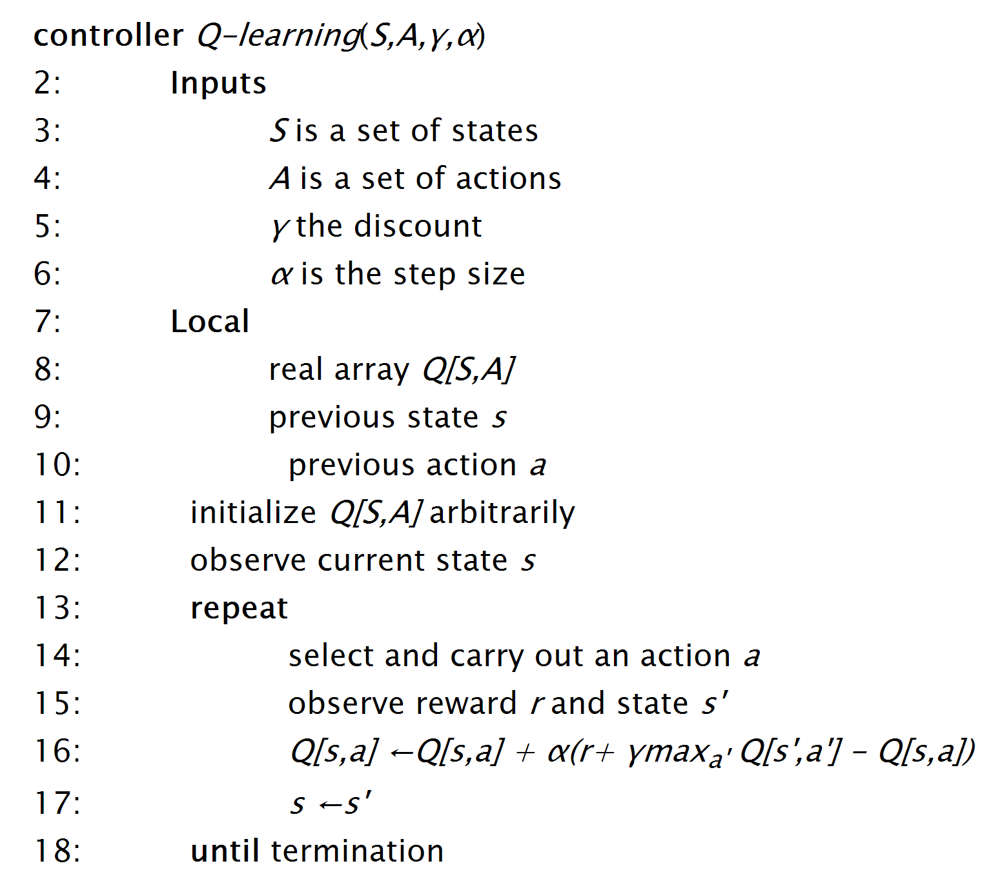

- Modify the single q-table code to double layers

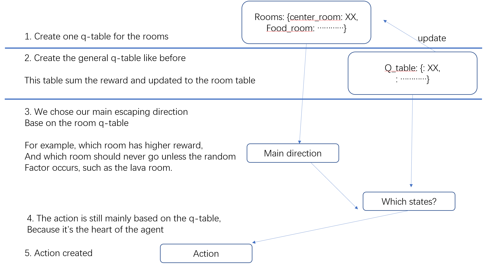

- Overcome the fact that the agent might be caught by the police, which creates trouble for the agent to learn with the previous version of the algorithm

Basically, we do something that is similar to the deep reinforcement learning. We use the double q-learning strategy to make a decision to whether the table should be updated or the clone one should be updated.

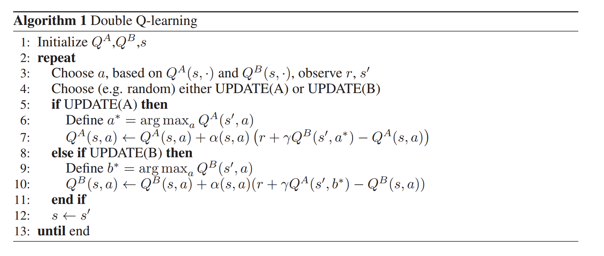

- Finally succeed

### Machine learning

In our project, we applied a lot of machine learning strategy

## Evaluation

- Quantitative Evaluation
  - 
 
- Qualitative Evaluation
  - 

## References

- The information of Mike Wallace: https://en.wikipedia.org/wiki/Mike_Wallace

- More information of Mike Wallace: http://baike.baidu.com/item/%E8%BF%88%E5%85%8B%C2%B7%E5%8D%8E%E8%8E%B1%E5%A3%AB?fromtitle=Mike+Wallace&fromid=11258487

- Police arresting image: https://www.selectsr22insurance.com/10-facts-about-getting-arrested-for-dui/

- Reinforcement Learning wikipedia page: https://en.wikipedia.org/wiki/Reinforcement_learning

- MDP wikipedia page: https://en.wikipedia.org/wiki/Markov_decision_process

- Q-learning wikipedia page: https://en.wikipedia.org/wiki/Q-learning

- Article about Q-learning: http://artint.info/html/ArtInt_265.html

- Piazza: https://piazza.com/class/j0lnpjwfdj4150

- stackoverflow: https://stackoverflow.com/

- Q-learning tutorial: http://mnemstudio.org/path-finding-q-learning-tutorial.htm

- MDP examples: https://isites.harvard.edu/fs/docs/icb.topic540049.files/cs181_lec03_handout.pdf

- Minecraft Prison Break example: http://www.minecraftforum.net/forums/mapping-and-modding/maps/1515166-prison-break-minecraft-adventure-map

- Reinforcement learning q-learning explanation: https://studywolf.wordpress.com/2012/11/25/reinforcement-learning-q-learning-and-exploration/

- Reinforcement learning code example: https://github.com/tflearn/tflearn/blob/master/examples/reinforcement_learning/atari_1step_qlearning.py

- Malmo tutorial: https://github.com/Microsoft/malmo

- Minecraft Wiki: http://minecraft.gamepedia.com/Minecraft_Wiki and http://www.minecraft101.net/index.html

- Introduction of MDP and reinforcement learning: https://www.cs.cmu.edu/~epxing/Class/10701-08s/Lecture/lecture27-RL.pdf

- Study Wolf: https://studywolf.wordpress.com/2012/11/25/reinforcement-learning-q-learning-and-exploration/

- 
